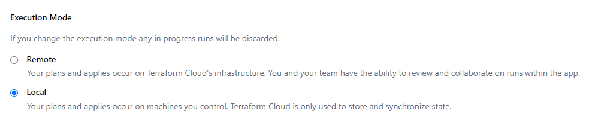

# Driving OpenZiti Network Management with Terraform

Take OpenZiti for a spin with Terraform on Kubernetes. This will guide you to apply a Terraform plan for each stage:

1. Create a cluster with OpenZiti installed and ready for Console and CLI access.
1. Provision your first OpenZiti router.
1. Configure some OpenZiti Services.
1. Configure your OpenZiti Client for network access.

## Kubernetes Services

* `ingress-nginx` w/ Nodebalancer
* `cert-manager` w/ Let's Encrypt issuer
* `trust-manager`
* `ziti-controller`
* `ziti-console`
* `ziti-router`
* `httpbin` demo API

## Required Local Software

* `ziti`
* `helm`
* `kubectl`
* `terraform`
* `ansible` with `ansible-galaxy collection install kubernetes.core`
* `pip install --user kubernetes jmespath dnspython`

## Recommended Tools

* [an OpenZiti Tunneler](https://docs.openziti.io/docs/downloads/)
* `k9s`
* `curl`
* `jq`


## Delegate DNS

1. Delegate a DNS zone to Linode's NSs so Terraform can manage the domain. For example, to delegate my-ziti-cluster.example.com to Linode, you need to create NS records in example.com named "my-ziti-cluster." You can verify it's working by checking the NS records with `dig` or [Google DNS Toolbox](https://toolbox.googleapps.com/apps/dig/#NS/) (record type `NS`).

    ```bash
    $ dig +noall +answer my-ziti-cluster.example.com. NS
    my-ziti-cluster.example.com.    1765    IN      NS      ns5.linode.com.
    my-ziti-cluster.example.com.    1765    IN      NS      ns4.linode.com.
    my-ziti-cluster.example.com.    1765    IN      NS      ns2.linode.com.
    my-ziti-cluster.example.com.    1765    IN      NS      ns3.linode.com.
    my-ziti-cluster.example.com.    1765    IN      NS      ns1.linode.com.
    ```

## Set up a Terraform Cloud Organization

This is an optional step. If you plan to use the OpenZiti network for anything important, then go ahead and do this. The plans use the local state backend, which will work fine for demonstration purposes.

1. Configure your shell env for this TF plan.

    ```bash
    export TF_VAR_LINODE_TOKEN=XXX         # Linode API token
    export KUBECONFIG=./kube-config        # TF will write this file in plan dir
    ```

    ***Note:*** If you want to save state in [Terraform Cloud](https://app.terraform.io/app), configure the additional env vars, uncomment `cloud {}` and comment out `backend "local" {}` in `main.tf` file.

    ```bash
    export TF_CLOUD_ORGANIZATION=XXX
    export TF_WORKSPACE=XXX
    ```

    Furthermore, you need to select your remote workspace to only save state, and not run the plan remotely. The default execution mode in Terraform Cloud is remote execution, and that will not work with this plan because it uses some Ansible which.

    

## Apply the Kubernetes Terraform Plan

This first TF plan creates the LKE cluster and installs an OpenZiti Controller and Console with a Let's Encrypt certificate.

1. In `./plan-10-k8s/terraform.tfvars`, specify the Linode size and count, etc., e.g.,

    ```hcl
    label = "my-ziti-cluster"
    email = "me@example.com"
    domain_name = "my-ziti-cluster.example.com"
    region = "us-west"
    pools = [
        {
            type : "g6-standard-2"
            count : 2
        }
    ]
    tags = ["alice-ziti-lab"]
    ```

1. Initialize the workspace.

    ```bash
    (cd ./plan-10-k8s/; terraform init;)
    ```

1. Perform a dry run.

    ```bash
    (cd ./plan-10-k8s/; terraform plan;)
    ```

1. Apply the plan.

    ```bash
    (cd ./plan-10-k8s/; terraform apply;)
    ```

1. Test cluster connection.

    ```bash
    # KUBECONFIG=./kube-config
    kubectl cluster-info
    ```

1. Print the Ziti login credential.

    ```bash
    kubectl -n ziti-controller get secrets ziti-controller-admin-secret \
        -o go-template='{{range $k,$v := .data}}{{printf "%s: " $k}}{{if not $v}}{{$v}}{{else}}{{$v | base64decode}}{{end}}{{"\n"}}{{end}}' 
    ```

    Example output:

    ```bash
    $ kubectl -n ziti-controller get secrets ziti-controller-admin-secret \
        -o go-template='{{range $k,$v := .data}}{{printf "%s: " $k}}{{if not $v}}{{$v}}{{else}}{{$v | base64decode}}{{end}}{{"\n"}}{{end}}' 
    admin-password: Gj63NwmZUJPwXsqbkzx8eQ6cdG8YBxP7
    admin-user: admin
    ```

1. Visit the console: https://console.my-ziti-cluster.example.com
1. Check the certificate. If it's from "(STAGING) Let's Encrypt" then the certificate issuer is working. If not, it's probably DNS.

    ```bash
    openssl s_client -connect console.my-ziti-cluster.example.com:443 <> /dev/null 2>&1 \
        | openssl x509 -noout -subject -issuer
    ```

    ```bash
    $ openssl s_client -connect console.my-ziti-cluster.example.com:443 <> /dev/null 2>&1 | openssl x509 -noout -subject -issuer
    subject=CN = console.my-ziti-cluster.example.com
    issuer=C = US, O = (STAGING) Let's Encrypt, CN = (STAGING) Artificial Apricot R3
    ```

1. Optionally, switch to Let's Encrypt Prod issuer for a *real* certificate. Uncomment these lines in `terraform.tfvars` and run `terraform apply`. The cert rate limit is real, hence Staging.

    ```bash
    cluster_issuer_name = "cert-manager-production"
    cluster_issuer_server = "https://acme-v02.api.letsencrypt.org/directory"
    ```

1. Probe the Ziti ingresses. Swap in the following subdomains (substituting your parent zone) to the same `openssl` command you used to probe the console above. All server certificates were issued by the controller's edge signer CA. You can configure [advanced PKI](https://docs.openziti.io/helm-charts/charts/ziti-controller/#advanced-pki) with Helm values.

* `ctrl.my-ziti-cluster.example.com:443`: control plane provided by the controller, consumed by routers
* `client.my-ziti-cluster.example.com:443`: edge client API provided by the controller, consumed by routers and edge client SDKs
* `management.my-ziti-cluster.example.com:443`: edge management API provided by the controller, consumed by `ziti` CLI, OpenZiti Console, and integrations like the Terraform Provider.
* `router1-edge.my-ziti-cluster.example.com:443`: edge listener provided by router1, consumed by Edge SDKs connecting to OpenZiti Services.
* `router1-transport.my-ziti-cluster.example.com:443`: link listener provided by router1, consumed by future routers you might add

    ```bash
    openssl s_client -connect management.my-ziti-cluster.example.com:443 <>/dev/null \
        |& openssl x509 -noout -text \
        | grep -A1 "Subject Alternative Name" \
        | sed -E 's/,?\s+(DNS|IP)/\n\t\t\1/g'
            X509v3 Subject Alternative Name:

                DNS:localhost
                DNS:ziti-controller
                DNS:ziti-controller-ctrl
                DNS:ziti-controller-ctrl.ziti
                DNS:ziti-controller-ctrl.ziti.svc
                DNS:ziti-controller-ctrl.ziti.svc.cluster
                DNS:ziti-controller-ctrl.ziti.svc.cluster.local
                DNS:ctrl.my-ziti-cluster.example.com
                DNS:ziti-controller-client
                DNS:ziti-controller-client.ziti
                DNS:ziti-controller-client.ziti.svc
                DNS:ziti-controller-client.ziti.svc.cluster
                DNS:ziti-controller-client.ziti.svc.cluster.local
                DNS:client.my-ziti-cluster.example.com
                DNS:ziti-controller-mgmt
                DNS:ziti-controller-mgmt.ziti
                DNS:ziti-controller-mgmt.ziti.svc
                DNS:ziti-controller-mgmt.ziti.svc.cluster
                DNS:ziti-controller-mgmt.ziti.svc.cluster.local
                DNS:management.my-ziti-cluster.example.com
                IP Address:127.0.0.1
    ```

1. Run `ziti` CLI remotely in the admin container. Change the command to `bash` to log in interactively. Then run `zitiLogin`.

    ```bash
    # find the pod name
    kubectl --namespace ziti-controller get pods

    # exec in the controller pod
    kubectl --namespace ziti-controller exec \
        --stdin --tty \
        ziti-controller-6c79575bb4-lh9nt \
        --container ziti-controller-admin -- \
            bash -c '
                zitiLogin &>/dev/null; 
                ziti edge list ers --output-json' \
    | jq --slurp 
    ```

1. Login `ziti` CLI locally.

    ```bash
    kubectl get secrets "ziti-controller-admin-secret" \
        --namespace ziti \
        --output go-template='{{index .data "admin-password" | base64decode }}' \
    | xargs ziti edge login management.my-ziti-cluster.example.com:443 \
        --yes \
        --username admin \
        --password
    ```

1. Forward local port 1280/tcp to the Ziti management API.

    You have the option to delete the management API Ingress and access it through a kubectl port forward or an OpenZiti service. The OpenZiti Service address created by the services plan will match one a DNS SANs on the controller's server certificate: "mgmt.ziti."

    ```bash
     kubectl port-forward services/ziti-controller-mgmt \
        --namespace ziti \
        1280:443
     ```

1. Login `ziti` CLI with the port forward.

    ```bash
    kubectl get secrets "ziti-controller-admin-secret" \
        --namespace ziti \
        --output go-template='{{index .data "admin-password" | base64decode }}' \
    | xargs ziti edge login localhost:1280 \
        --yes \
        --username admin \
        --password
    ```

1. Save the management API spec. If you're automating or integrating the API, it's a good idea to reference your running controller's built-in spec to ensure compatibility.

    ```bash
    curl -sk https://localhost:1280/edge/management/v1/swagger.json \
    | tee /tmp/swagger.json
    ```

1. Visit the Management API reference in a web browser. https://localhost:1280/edge/management/v1/docs


## Apply the Router Terraform Plan

This plan will deploy an OpenZiti Router. The main reason it's separate from the first plan is that the OpenZiti Terraform Provider gets configuration input from the Kubernetes plan's TF state.

1. Initialize the workspace.

    ```bash
    (cd ./plan-20-router/; terraform init;)
    ```

1. Perform a dry run.

    ```bash
    (cd ./plan-20-router/; terraform plan;)
    ```

1. Apply the plan.

    ```bash
    (cd ./plan-20-router/; terraform apply;)
    ```

## Apply the Services Terraform Plan

This plan will create some OpenZiti Services:

1. a demo API running `httpbin`
1. the OpenZiti Management API as an OpenZiti Service (so you can firewall it off later if you like)
1. the Kubernetes apiserver

1. Initialize the workspace.

    ```bash
    (cd ./plan-30-services/; terraform init;)
    ```

1. Perform a dry run.

    ```bash
    (cd ./plan-30-services/; terraform plan;)
    ```

1. Apply the plan.

    ```bash
    (cd ./plan-30-services/; terraform apply;)
    ```

## Apply the Client Terraform Plan

This plan will help you get started using OpenZiti Services with a Tunneler.

1. Initialize the workspace.

    ```bash
    (cd ./plan-40-client/; terraform init;)
    ```

1. Perform a dry run.

    ```bash
    (cd ./plan-40-client/; terraform plan;)
    ```

1. Apply the plan.

    ```bash
    (cd ./plan-40-client/; terraform apply;)
    ```

1. Add the demo client identity to Ziti Desktop Edge. The JWT is saved in `/tmp/edge-client1.jwt`.

1. Test the demo API.

    ```bash
    curl -sSf -XPOST -d ziti=awesome http://webhook.ziti/post | jq .data
    ```

1. Use the Kubernetes API over Ziti

    Terraform modified your Kubeconfig to have a new Ziti context named like "ziti-lke12345-ctx" pointing to the Ziti service for the Kubernetes apiserver instead of the public Linode service. Find the name and select it with `kubectl`.

    ```bash
    $ kubectl config get-contexts
    CURRENT   NAME                CLUSTER             AUTHINFO         NAMESPACE
    *         lke95021-ctx        lke95021            lke95021-admin   default
            ziti-lke95021-ctx   ziti-lke95021-ctx   lke95021-admin   

    $ kubectl --context ziti-lke12345-ctx cluster-info
    Kubernetes control plane is running at https://kubernetes.default.svc
    KubeDNS is running at https://kubernetes.default.svc/api/v1/namespaces/kube-system/services/kube-dns:dns/proxy
    ```

## Start Over with Fresh Ziti

Destroy the Terraform Plans in reverse order if you plan on re-using the directories. That way you won't have any problems with leftover Terraform State.

You can tear down the cluster like this.

```bash
(cd ./plan-40-client/; terraform destroy;)
(cd ./plan-30-services/; terraform destroy;)
(cd ./plan-20-router/; terraform destroy;)
(cd ./plan-10-k8s/; terraform destroy;)
```

In your Tunneler, i.e. Desktop Edge, remember to forget your identity. The OpenZiti Identity named "edge-client" in your Tunneler, that is.

If you uninstall `ingress-nginx` then your LoadBalancer public IP is released. You'll get a new one if you reinstall `ingress-nginx` with the first Kubernetes TF plan, but you'll have to wait for DNS to re-propagate.
